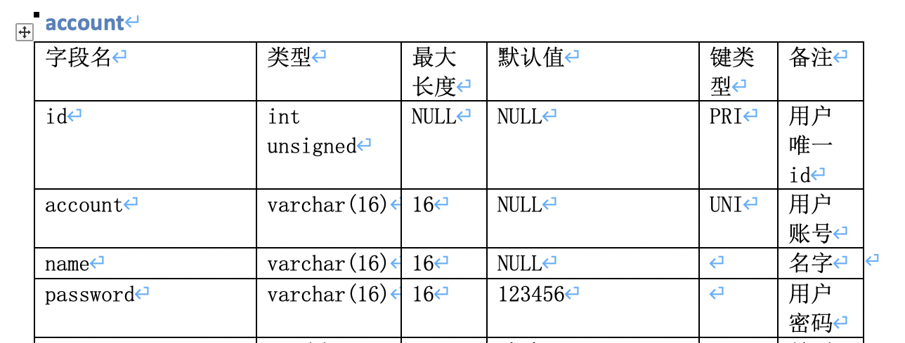

# 将数据库表结构转为word表格
*效果如下图*




# 使用
```bash
git clone https://github.com/wordfeng/db_table2docx.git
cd db_table2docx
pip3 install -r requirements.txt

# -h host
# -P port
# -u root
# -p password
# -db databasename
python3 main.py -h localhost -P 3306 -u root -p root -db databasename
# docx默认在db_table2docx/output/
```
# 特殊字号对应关系
|字号	|磅值
|---|---|
|初号	|42
|小初	|36
|一号	|26
|小一	|24
|二号	|22
|小二	|18
|三号	|16
|小三	|15
|四号	|14
|小四	|12
|五号	|10.5
|小五	|9
|六号	|7.5
|小六	|6.5
|七号	|5.5
|八号	|5
